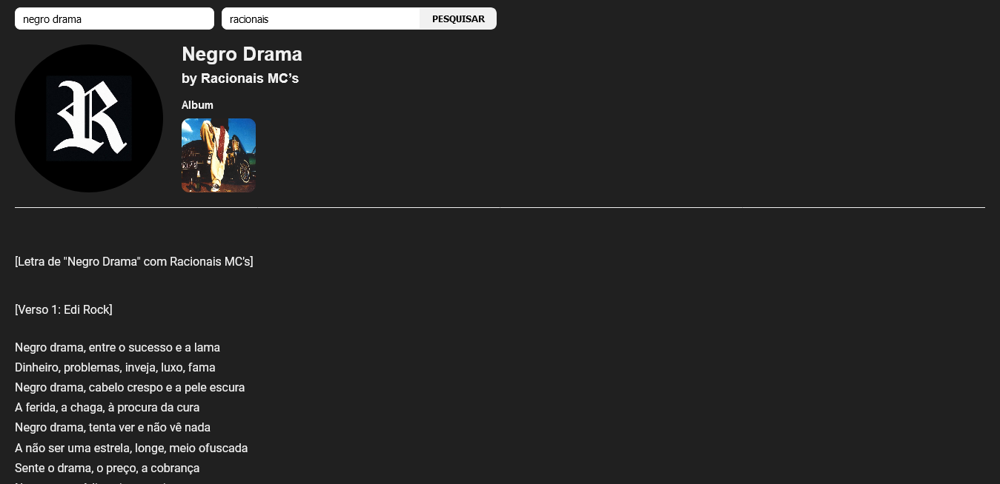

# Lyrics Finder

Esta aplicação consiste em um buscador de letras de música feito utilizando a Genius API, para a finalização do bootcamp MRV Front End SPA Developer da plataforma Digital Innovation One.

Para encontrar uma música, basta inserir o nome da mesma e o artista nos campos disponíveis na página e clicar no botão "Pesquisar". Caso um dos campos não seja preenchido, não haverá retorno. Para melhores resultados, inserir os nomes corretos e completos.

A aplicação pode ser acessada [aqui](https://lyrics-finder-project.netlify.app/).

## Sumário

- [Visão Geral](#visão-geral)
  - [O Desafio](#o-desafio)
  - [Screenshots](#screenshots)
- [Desenvolvimento](#desenvolvimento)
  - [Ferramentas utilizadas](#ferramentas-utilizadas)
  - [Lições aprendidas](#lições-aprendidas)
  - [Melhorias futuras](#melhorias-futuras)
  - [Recursos úteis](#recursos-úteis)
- [O Autor](#o-autor)

## Visão Geral

### O Desafio

A proposta do projeto era a de se construir uma SPA totalmente componetizada utilizando React e fazer requisições para uma API desejada, a qual optei pela Genius API, a fim de fazer um buscador de letras de músicas.

### Screenshots

Abaixo há duas screenshots da aplicação criada. A primeira mostra a página logo ao ser acessada, onde nenhum dado foi inserido e ela retorna apenas os inputs e uma mensagem de "Nenhuma música pesquisada". Na segunda imagem é possível ver o resultado após os dados de música e artista serem inseridos e pesquisados.

Visualização inicial da página

Visualização da página após inserção dos dados

## Desenvolvimento

### Ferramentas utilizadas

Para execução do projeto foi utilizado, como requerido, a biblioteca [ReactJS](https://pt-br.reactjs.org/) e a [Genius API](https://docs.genius.com/).

Além disso, foram utilizados os pacotes:

- [axios ](https://www.npmjs.com/package/axios) para as requisições HTTP
- [cheerio-without-node-native](https://www.npmjs.com/package/cheerio-without-node-native) para manipulação de alguns dados
- [styled-components](https://styled-components.com/) para estilização de alguns componentes React
- [styled-reset](https://www.npmjs.com/package/styled-reset) para resetar os estilos iniciais dos browsers

Também utilizou-se o [ESLint](https://eslint.org/) e o [Prettier](https://prettier.io/) para se obter padronização do código.

### Lições aprendidas

Iniciei o projeto com o comando "Create React App" e construí a estrutura básica da página. Após isto, li a documentação da API e fiz a implementação da mesma, neste passo tive uma novidade que foi a necessidade de autenticação para acesso dos dados da API, a qual optei por fazer, devido a simplicidade do projeto, apenas através de um token.

Após construir a parte de requisição, com os dados recebidos fiz tanto a apresentação dos mesmos na interface, quanto a construção de outra função para requisitar a página que contém a letra da música desejada. Após receber esta página, a letra é extraída da mesma e tratada para posterior exibição no formato desejado. Nesta etapa tive dificuldades, pois nunca havia feito algo semelhante, então para me auxiliar nesse processo utilizei o pacote [genius-lyrics-api] (https://www.npmjs.com/package/genius-lyrics-api).

Outros pontos que pude desenvolver melhor foi: a estilização com o styled-components, que havia apresentado dificuldades em projetos passados, mas agora consegui entender com mais propriedade; a adição mais fácil do eslint, porém, ainda utilizei uma configuração padrão de um projeto anterior; a organização das pastas do diretório, deixando o código mais fácil de ser entendido; e a utilização de variáveis de ambiente para esconder chaves de acesso.

### Melhorias futuras

- Trabalhar melhor o design da página
- Apresentar mais informações sobre o artista
- Adicionar uma lista de músicas como retorno da pesquisa, ao invés do resultado direto
- Exibir uma mensagem para o usuário quando algum input não for preenchido
- Exibir uma mensagem de "não encontrado" para o usuário

### Recursos úteis

Além das documentações específicas de cada item, os seguintes recursos tiveram grande contribuição.

[Async/Await JS and Promises](https://www.youtube.com/watch?v=XCLtVQl1if0) - vídeo sobre a utilização correta do async/await

[Playlist do professor Matheus Benites](https://www.youtube.com/playlist?list=PLTv2Rbwcr_Cru7KIHcffE1Shg9X9Eix7a) - responsável por guiar e auxiliar o projeto

[StackOverflow](https://stackoverflow.com/) - que me ajudou a resolver algumas questões específicas.

## O Autor

Projeto desenvolvido por Luiz Felipe, abaixo deixo meu Github com alguns projetos que realizei, meu LinkedIn e contato.

Github - [lufesipe](https://github.com/lufesipe)

LinkedIn - [Luiz Felipe](www.linkedin.com/in/luiz-felipe-sp)

Email - [luizfspereira@outlook.com](mailto:luizfspereira@outlook.com)

